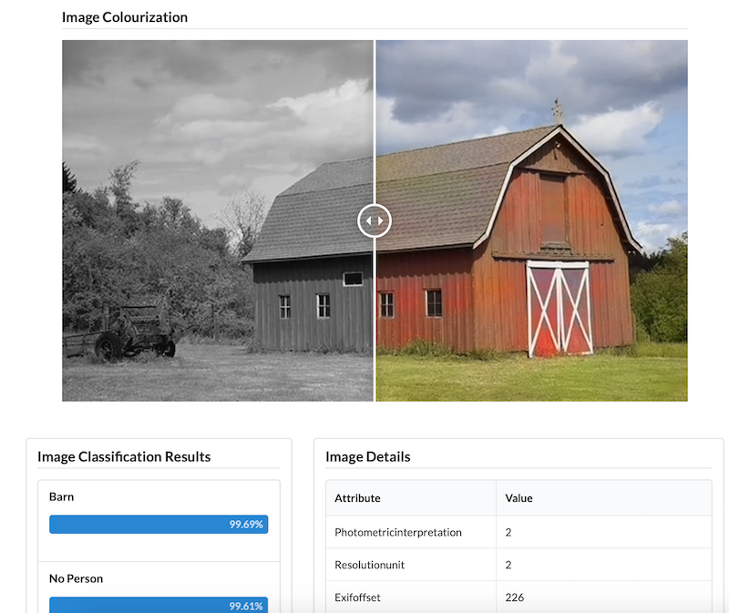

# Forensic Image Analysis

This webapp is meant to simulate several types of image analysis that would be performed during [forensic analysis](https://en.wikipedia.org/wiki/Digital_forensics). The main use case is the identification and enhancement of monochrome images, such as those taken from security cameras.

## Use

The user is prompted to upload an image from their computer. **It is suggested that the user upload a monochromatic image for best effect.** After submission, the image is run through several services which perform Deep Colourization (ie, conversion of black-and-white to colour), image classification, and metadata extraction.

As this takes time to complete, the user is expected to enter an email address to be notified upon completion. The email will contain a link to the results page where they can view the image analysis.

 

## Services and Frameworks

This application was designed to be hosted on a cloud Platform-as-a-Service provider such as Heroku. Therefore, all data and major computation was offloaded to other cloud providers.

The following services were used:

| Service         | Reason               |
| --------------- | -------------------- |
| Heroku          | PaaS                 |
| Google Firebase | Datafile storage     |
| Cloudinary      | Image storage        |
| Deepai.org      | Image Colourization  |
| Clarifai.com    | Image Classification |
| SendGrid        | Email notifications  |

Additionally, the following frameworks were used for the development of the application:

- Python 3.7
  - Flask
  - Pyrebase
  - Cloudinary
  - SendGrid
  - Requests
  - Pillow
  - Gunicorn
  - Jinja2
- Pug.JS

### Building

1. After cloning this repository, install the Python 3+ dependencies through `pip` with the following shell command:

~~~~shell
pip install -r requirements.txt
~~~~

2. You **must** populate `api_keys.py` with the respective API Keys from the aforementioned services.
3. Run the app through Flask, or by simply running `python app.py`.
4. Optionally, a Procfile is included for use on Heroku

